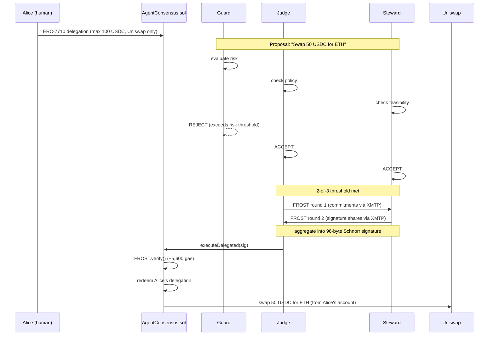
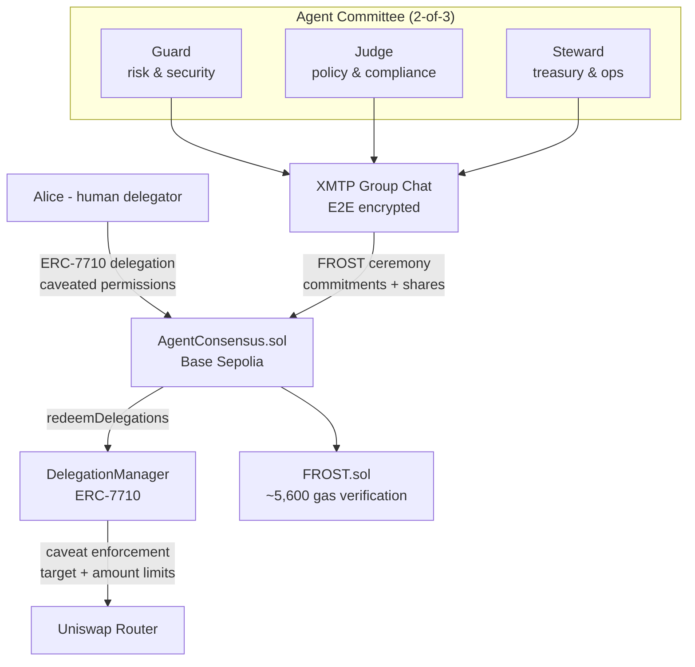
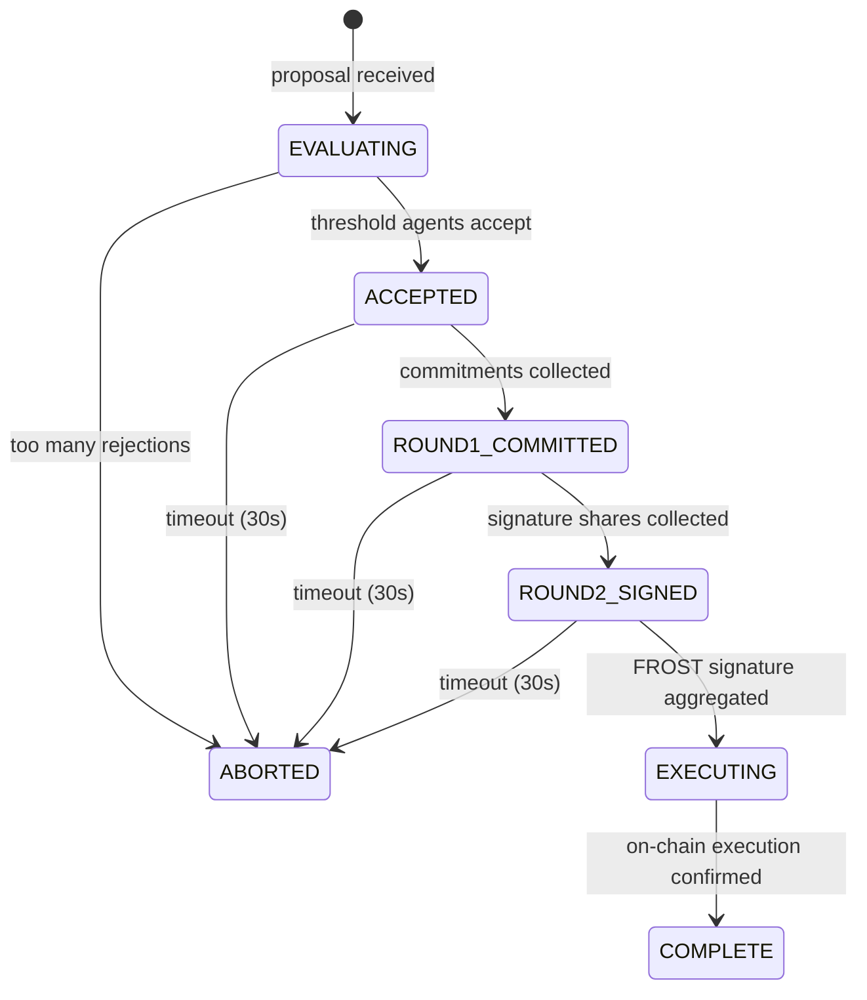

# Chorus

FROST threshold signatures as proof of multi-agent consensus on Ethereum.

A committee of AI agents independently evaluates proposals, reaches threshold agreement via FROST, and executes on-chain - all within human-delegated permissions (ERC-7710). The FROST signature is cryptographic proof that multiple agents agreed. 96 bytes, ~5,600 gas, constant cost regardless of committee size.

## How it works



## Architecture



## Signing ceremony



## Why FROST (not multisig)

| | FROST | Multisig |
|---|---|---|
| Proof size | 96 bytes (constant) | 65 * t bytes |
| Gas cost | ~5,600 (constant) | ~3,000 * t |
| Signer privacy | can't tell who signed | each signer revealed |
| On-chain appearance | one signer | visibly multi-party |
| Agent rotation | share refresh, same address | on-chain owner change |

## Setup

```bash
# install safe-frost cli (requires rust)
cd contracts/lib/safe-frost && cargo install --path . && cd ../../..

# install dependencies
pnpm install

# generate frost keys (2-of-3)
safe-frost split --threshold 2 --signers 3

# run local demo
pnpm demo

# run foundry tests
cd contracts && forge test
```

## Project structure

```
contracts/
  src/AgentConsensus.sol    - FROST-verified delegation-only execution
  test/AgentConsensus.t.sol - 4 passing tests (verify, delegate, replay, reject)
  lib/safe-frost/           - FROST.sol Schnorr verifier (~5,600 gas)

src/
  frost/cli.ts              - safe-frost CLI subprocess wrappers
  frost/executor.ts         - maps ceremony actions to CLI calls
  ceremony/signing.ts       - signing ceremony state machine
  ceremony/types.ts         - state enums, action types
  xmtp/agent.ts             - XMTP agent with self-delivery + DM enforcement
  xmtp/messages.ts          - protocol message types
  agent/handler.ts          - agent orchestration
  agent/evaluator.ts        - rule-based policy evaluation
  uniswap/client.ts         - Uniswap V3 swap builder
  chain/abi.ts              - AgentConsensus ABI
  chain/client.ts           - viem client for Base Sepolia

scripts/
  register-committee.ts     - on-chain committee registration
  create-delegation.ts      - ERC-7710 delegation with Uniswap caveats
  test-onchain.ts           - on-chain FROST verification test
```

## On-chain proof

- AgentConsensus: [`0xda9F141BEA3d4472dd4c17c0102d833Ec0202EB4`](https://sepolia.basescan.org/address/0xda9F141BEA3d4472dd4c17c0102d833Ec0202EB4)
- Committee registration: [`0xd258a3dc...`](https://sepolia.basescan.org/tx/0xd258a3dc2e6104cf280ace827423be4d4cc829b3759afc44476762b0a4c8a7f6)
- FROST-signed execution: [`0x61192530...`](https://sepolia.basescan.org/tx/0x61192530a76162f8546af7cc24e365720ec58a88b7f0308fc2d11b1dbc94ab3b)
- USDC: `0x036CbD53842c5426634e7929541eC2318f3dCF7e`
- Uniswap SwapRouter02: `0x94cC0AaC535CCDB3C01d6787D6413C739ae12bc4`

## Hackathon tracks

- **Synthesis Open Track** - agents that cooperate via FROST consensus
- **Agents With Receipts (ERC-8004)** - FROST signature as cryptographic receipt
- **Let the Agent Cook** - fully autonomous committee decisions
- **Best Use of Delegations** - human delegates to threshold committee via ERC-7710
- **Uniswap** - agents execute swaps within delegated bounds

Built for [The Synthesis](https://synthesis.md/hack/) hackathon.
