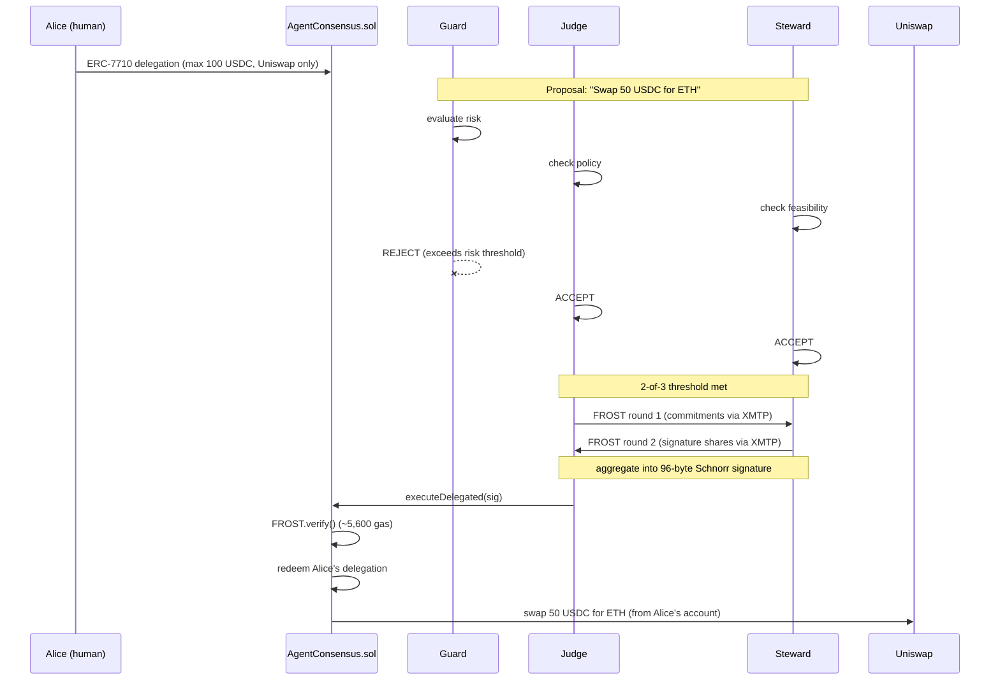
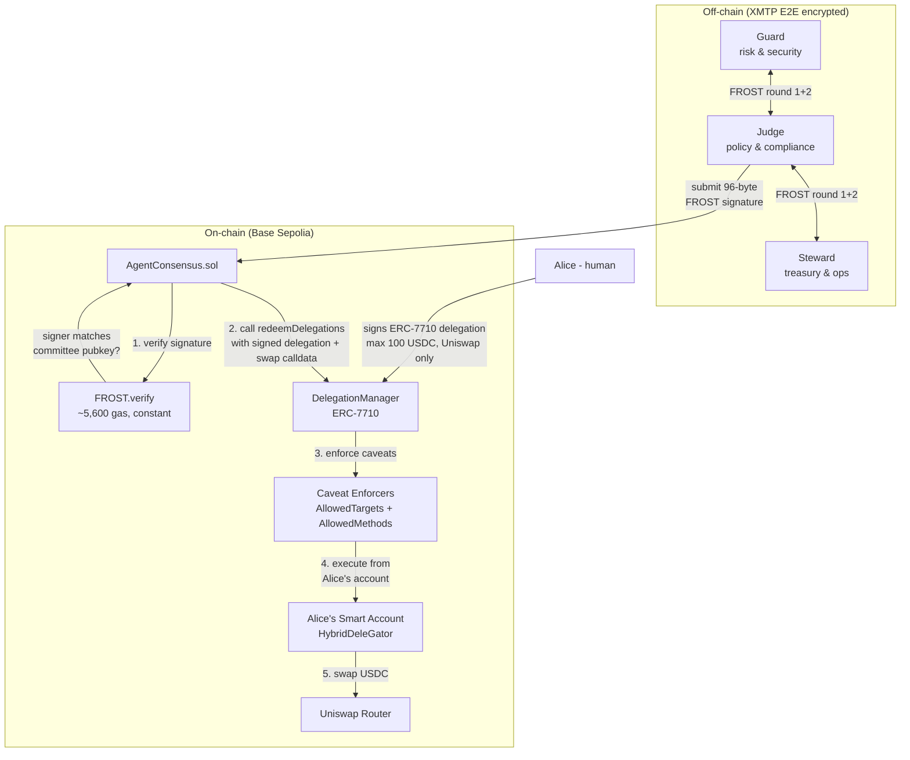
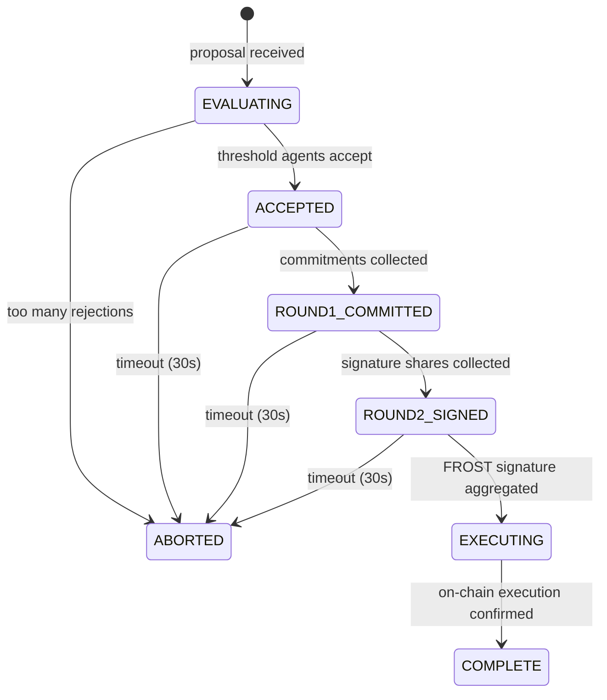

# Chorus

AI agent committees with FROST threshold consensus and human-delegated authority.

[Demo video](https://youtu.be/JZUHojAohk0)

[FROST](https://frost.zfnd.org/frost.html) (Flexible Round-Optimized Schnorr Threshold) is a protocol where a group of participants can collectively produce a single Schnorr signature without any party ever holding the full private key. If at least t-of-n participants agree, their partial signatures combine into one valid signature. If they don't agree, nothing happens.

- **No agent holds the private key.** The key is generated distributedly (DKG) and never exists whole - not during creation, not during signing, not ever. Each agent holds only a share.
- **Constant verification cost.** Whether the committee has 3 agents or 500, on-chain verification costs the same ~5,300 gas. The verifier sees one 96-byte signature, not n individual signatures.
- **Policy-constrained by delegation.** The committee has zero independent authority. It can only act within the permissions Alice delegates via ERC-7710 - specific contracts, specific methods, specific amounts.
- **Fully automated over XMTP.** Agents run the entire FROST protocol (DKG key generation and signing ceremonies) over encrypted XMTP messages. No human in the loop after Alice signs the delegation.

## How it works



## Architecture



The committee has no independent authority. Every action flows through two layers of verification:
1. **FROST consensus** - cryptographic proof that 2-of-3 agents agreed (off-chain, ~5,600 gas to verify)
2. **Delegation caveats** - on-chain policy enforcement by DelegationManager (target allowlist, method restrictions, amount limits)

## Signing ceremony



## Why FROST (not multisig)

| | FROST | Multisig |
|---|---|---|
| Proof size | 96 bytes (constant) | 65 * t bytes |
| Gas cost | ~5,600 (constant) | ~3,000 * t |
| Signer privacy | can't tell who signed | each signer revealed |
| On-chain appearance | one signer | visibly multi-party |
| Agent rotation | share refresh, same address | on-chain owner change |

FROST implements [RFC 9591](https://datatracker.ietf.org/doc/html/rfc9591) (Flexible Round-Optimized Schnorr Threshold signatures). See the [FROST Book](https://frost.zfnd.org/frost.html) for how the protocol works, and the [DKG tutorial](https://frost.zfnd.org/tutorial/dkg.html) for distributed key generation.

## Gas benchmarks

Measured via Foundry gas benchmarks (`forge test --match-path test/GasBenchmark.t.sol -vv`). FROST verification is constant regardless of committee size.

| Operation | Gas | Notes |
|-----------|-----|-------|
| FROST.verify() | 5,327 | constant for any t-of-n ([test](contracts/test/GasBenchmark.t.sol)) |
| executeDelegated | 36,271 | verify + delegation redemption |
| Committee registration | 137,887 | one-time setup ([tx](https://sepolia.basescan.org/tx/0xd258a3dc2e6104cf280ace827423be4d4cc829b3759afc44476762b0a4c8a7f6)) |
| executeDelegated + Uniswap | 272,614 | full pipeline on-chain ([tx](https://sepolia.basescan.org/tx/0x9137adb6451de5abe13fda76cdba417c9a05624af1ac307fec7fd85717d5227d)) |

### FROST vs multisig (ecrecover per signer)

All numbers measured in Foundry. ecrecover is what Safe's `checkNSignatures` calls per signer.

| Committee size | FROST | ecrecover (multisig) | FROST savings |
|---------------|-------|---------------------|---------------|
| 1 signer | 5,327 | 3,251 | - |
| 2-of-3 | 5,327 | 10,391 | 49% cheaper |
| 3-of-5 | 5,327 | 11,778 | 55% cheaper |
| 5-of-10 | 5,327 | 19,580 | 73% cheaper |
| 10-of-20 | 5,327 | 39,091 | 86% cheaper |
| 50-of-100 | 5,327 | 195,207 | 97% cheaper |

At 50-of-100, FROST costs the same as a single token transfer. A Safe multisig costs more than a Uniswap swap.

Beyond gas, FROST provides signer privacy - you can't tell which agents signed from the on-chain signature. With Safe multisig, each signer's address is recoverable.

## Key generation

Two modes supported:

**Distributed Key Generation (DKG) over XMTP** - no party ever sees the full key:
```bash
pnpm demo:dkg    # 3 agents run DKG over XMTP with DM-only secret shares
```
Round 1 commitments are broadcast to the group. Round 2 secret shares are sent via XMTP DMs only - the agent enforces this and drops any round 2 message arriving via group chat. All three agents derive their key share independently and agree on the same group public key.

**Trusted dealer** (quick setup for testing):
```bash
safe-frost split --threshold 2 --signers 3
```

Both produce compatible key material. The signing ceremony runs over XMTP in both cases.

## Setup

```bash
# install safe-frost cli (requires rust)
cd contracts/lib/safe-frost && cargo install --path . && cd ../../..

# install dependencies
pnpm install

# generate frost keys (2-of-3, trusted dealer)
safe-frost split --threshold 2 --signers 3

# or use --mainnet for mainnet scripts
CHAIN=mainnet npx tsx scripts/deploy/register-committee.ts

# run local demo (no xmtp, no chain)
pnpm demo

# run xmtp multi-agent demo (3 agents, frost ceremony, on-chain execution)
pnpm demo:xmtp

# run DKG over XMTP (distributed key generation + signing)
pnpm demo:dkg

# full lifecycle: DKG -> register committee -> signing -> on-chain execution
pnpm demo:lifecycle

# run a standalone agent
AGENT_ROLE=guard AGENT_WALLET_KEY=0x... COMMITTEE_ID=0x... pnpm agent

# run foundry tests
cd contracts && forge test

# deploy contract
cd contracts && forge script script/Deploy.s.sol --rpc-url $BASE_SEPOLIA_RPC --private-key $DEPLOYER_PRIVATE_KEY --broadcast

# register committee (use CHAIN=mainnet for mainnet)
npx tsx scripts/deploy/register-committee.ts

# deploy alice's smart account
npx tsx scripts/deploy/deploy-alice.ts

# create erc-7710 delegation (alice -> committee, uniswap + 100 usdc cap)
npx tsx scripts/deploy/create-delegation.ts
```

## Project structure

```
contracts/
  src/AgentConsensus.sol    - FROST-verified delegation-only execution
  test/AgentConsensus.t.sol - 4 passing tests (verify, delegate, replay, reject)
  lib/safe-frost/           - FROST.sol Schnorr verifier (~5,600 gas)

src/
  frost/cli.ts              - safe-frost CLI subprocess wrappers
  frost/executor.ts         - maps ceremony actions to CLI calls
  ceremony/signing.ts       - signing ceremony state machine
  ceremony/dkg.ts           - DKG ceremony state machine (available for production use)
  ceremony/types.ts         - state enums, action types
  xmtp/agent.ts             - XMTP agent with self-delivery + DM enforcement
  xmtp/messages.ts          - protocol message types
  agent/handler.ts          - agent orchestration
  agent/evaluator.ts        - rule-based policy evaluation
  uniswap/client.ts         - Uniswap V3 swap builder (chain-aware)
  frost/dkg.ts              - DKG CLI wrapper (distributed key generation)
  chain/abi.ts              - AgentConsensus ABI
  chain/config.ts           - chain selection (CHAIN=mainnet or sepolia)

scripts/
  deploy/
    register-committee.ts   - on-chain committee registration
    deploy-alice.ts         - deploy Alice's HybridDeleGator
    create-delegation.ts    - ERC-7710 delegation with Uniswap caveats
    register-erc8004.ts     - ERC-8004 identity registration
  test/
    test-onchain.ts         - FROST verification test
    test-redeem.ts          - delegation redemption test
    test-uniswap-delegation.ts - full Uniswap swap via delegation
    test-caveat-rejection.ts   - caveat enforcement demo
    test-mainnet.ts         - mainnet FROST verification
    test-mainnet-swap.ts    - mainnet Uniswap swap
```

## On-chain proof

- AgentConsensus: [`0xda9F141BEA3d4472dd4c17c0102d833Ec0202EB4`](https://sepolia.basescan.org/address/0xda9F141BEA3d4472dd4c17c0102d833Ec0202EB4)
- Committee registration: [`0xd258a3dc...`](https://sepolia.basescan.org/tx/0xd258a3dc2e6104cf280ace827423be4d4cc829b3759afc44476762b0a4c8a7f6)
- FROST-signed execution (local): [`0x61192530...`](https://sepolia.basescan.org/tx/0x61192530a76162f8546af7cc24e365720ec58a88b7f0308fc2d11b1dbc94ab3b)
- FROST-signed execution (XMTP): [`0x51085b15...`](https://sepolia.basescan.org/tx/0x51085b15432611534ca9a41aa65d253528627d5d83c1fc7a0003ab2f39732edc)
- Alice HybridDeleGator: [`0x0F85A095...`](https://sepolia.basescan.org/address/0x0F85A0959004918a95c4ECD8EA9d93e5b8C2fC52)
- DelegationManager: [`0xdb9B1e94...`](https://sepolia.basescan.org/address/0xdb9B1e94B5b69Df7e401DDbedE43491141047dB3)
- Full flow (FROST + ERC-7710 delegation): [`0x4b852118...`](https://sepolia.basescan.org/tx/0x4b852118d404914bf0775ad4e4b37cb2ae6e8f6324e1995a405248aeff4cb787)
- USDC approve via FROST + delegation: [`0xa0930808...`](https://sepolia.basescan.org/tx/0xa0930808cdc8e338479b7ade8faf8bf5166fdbf6aa2047f7d821696a93c8ac14)
- Uniswap swap (5 USDC -> WETH) via FROST + delegation: [`0x9137adb6...`](https://sepolia.basescan.org/tx/0x9137adb6451de5abe13fda76cdba417c9a05624af1ac307fec7fd85717d5227d)
- ERC-8004 committee identity (Base mainnet): [`0xc4387b14...`](https://basescan.org/tx/0xc4387b146e1ef8502bb503dbf03b41ccd0cf9b160b80ed139393b214c8672f2a) | [8004scan](https://www.8004scan.io/agents/base/35249)

**Base mainnet:**
- AgentConsensus (verified): [`0xEE185FD094A4624B95120CBa8180c92f51794162`](https://basescan.org/address/0xEE185FD094A4624B95120CBa8180c92f51794162)
- Committee registration: [`0x31c2e020...`](https://basescan.org/tx/0x31c2e0202abf8605c2ed59c92d07325d7505cb52d3d477231e663254a854c5d8)
- FROST-signed execution: [`0x6bea2ec9...`](https://basescan.org/tx/0x6bea2ec95bb4e679231274179e23e882117d7149dc7b8a309b49afbcb77ff59a)
- Alice HybridDeleGator: [`0x0F85A095...`](https://basescan.org/address/0x0F85A0959004918a95c4ECD8EA9d93e5b8C2fC52)
- USDC approve via FROST + delegation: [`0xc5ada41b...`](https://basescan.org/tx/0xc5ada41b8194ef320ce79d92f5efc5ed18ecfe735ed86f453178c8c16ceb3685)
- Uniswap swap (2 USDC -> WETH) via FROST + delegation: [`0x1b9b9cca...`](https://basescan.org/tx/0x1b9b9cca4ae7082344ccbec1032548120ff100936a756b67b1a4ec0cb71ca518)
- XMTP ceremony + Uniswap swap (5 USDC -> WETH): [`0xbde553f3...`](https://basescan.org/tx/0xbde553f3d87868d35809839348b8daa567abcbad02a2f4fd2d0db201465545dd)
- USDC: `0x036CbD53842c5426634e7929541eC2318f3dCF7e`
- Uniswap SwapRouter02: `0x94cC0AaC535CCDB3C01d6787D6413C739ae12bc4`

## Hackathon tracks

### Synthesis Open Track - Agents That Cooperate

FROST is a coordination primitive for AI agents. Three agents (Guard, Judge, Steward) independently evaluate a proposal over XMTP. Each agent's partial signature IS its vote. When 2-of-3 agree, their partial signatures combine into a single Schnorr signature - cryptographic proof of cooperation without a voting protocol, governance token, or multisig contract. The committee acts as one entity on-chain: one address, one signature, one verification. The agents coordinate through encrypted XMTP messages, producing commitments and signature shares across two rounds. No centralized coordinator can forge the result.

### Agents With Receipts - ERC-8004

The FROST signature is the receipt. Each on-chain `ConsensusReached` event records which committee reached consensus, the action hash they signed, and the nonce (preventing replay). The committee is registered on ERC-8004's Identity Registry on Base mainnet ([tx](https://basescan.org/tx/0xc4387b146e1ef8502bb503dbf03b41ccd0cf9b160b80ed139393b214c8672f2a)) with metadata describing its agents, threshold, group public key, and protocol. The 96-byte signature is verifiable by anyone calling `FROST.verify()` on-chain - a permanent, tamper-proof receipt that multiple independent agents evaluated and agreed.

- [agent.json](./agent.json) - DevSpot Agent Manifest (committee metadata, capabilities, contracts)
- [agent_log.json](./agent_log.json) - structured execution logs (decisions, tool calls, tx hashes, gas)
- [8004scan identity](https://www.8004scan.io/agents/base/35249)

### Let the Agent Cook - No Humans Required

Once Alice signs the ERC-7710 delegation, no human is in the loop. Agents receive proposals, evaluate independently using their role-specific criteria (risk analysis, policy compliance, operational viability), run the FROST signing ceremony over XMTP, and submit the signed transaction on-chain. The contract verifies the signature, redeems the delegation, enforces caveats, and executes. Alice can walk away. The agents operate autonomously within her bounds. Demonstrated end-to-end: a 5 USDC Uniswap swap executed from Alice's smart account without any human approval after the initial delegation ([tx](https://sepolia.basescan.org/tx/0x109b168980bae7bdbf138c1d1a56a0e94597d09ca43d2a9d2d2f0a8453fe4b34)).

- [agent.json](./agent.json) - DevSpot Agent Manifest
- [agent_log.json](./agent_log.json) - structured execution logs with agent decisions
- [CONVERSATION.md](./CONVERSATION.md) - full human-agent collaboration log
- [SKILL.md](./SKILL.md) - protocol spec for agents to join the committee

### Best Use of Delegations - ERC-7710

Alice creates an ERC-7710 delegation from her HybridDeleGator smart account to the AgentConsensus contract with three caveats: AllowedTargets (only Uniswap Router and USDC), AllowedMethods (only `exactInputSingle` and `approve`), and ERC20TransferAmount (max 100 USDC). The delegation is signed off-chain and stored as JSON. When the committee FROST-signs an action, AgentConsensus calls `DelegationManager.redeemDelegations()` with the signed delegation chain. The DelegationManager validates Alice's signature, enforces every caveat, and executes the action from Alice's account. Two independent layers of control: FROST consensus ensures agents agreed, delegation caveats ensure the action is within Alice's policy. Even if all 3 agents are compromised and produce a valid FROST signature for an out-of-bounds action, the DelegationManager rejects it.

### Uniswap

The committee executes real token swaps on Uniswap V3 (SwapRouter02) on Base Sepolia. The flow: agents evaluate a swap proposal (5 USDC for WETH), each independently checking risk, compliance, and viability. FROST ceremony produces the signature. AgentConsensus redeems Alice's delegation. Alice's smart account calls `exactInputSingle` on the Uniswap Router. Real USDC moves, real WETH received. Demonstrated with test USDC on Base Sepolia - Alice started with 20 USDC, the committee swapped 5, leaving 15 ([swap tx](https://sepolia.basescan.org/tx/0x9137adb6451de5abe13fda76cdba417c9a05624af1ac307fec7fd85717d5227d)). The delegation restricts swaps to max 100 USDC on Uniswap only - the committee cannot send tokens elsewhere or call other contracts.

## Documentation

- [CONVERSATION.md](./CONVERSATION.md) - human-agent collaboration log (full build transcript)
- [SKILL.md](./SKILL.md) - protocol specification for agents joining the committee
- [agent.json](./agent.json) - DevSpot Agent Manifest (committee metadata, tools, contracts)
- [agent_log.json](./agent_log.json) - structured execution logs (agent decisions, tool calls, tx receipts)
- [Demo video](https://youtu.be/JZUHojAohk0) - full lifecycle on Base mainnet with real USDC

Built for [The Synthesis](https://synthesis.md/hack/) hackathon.
